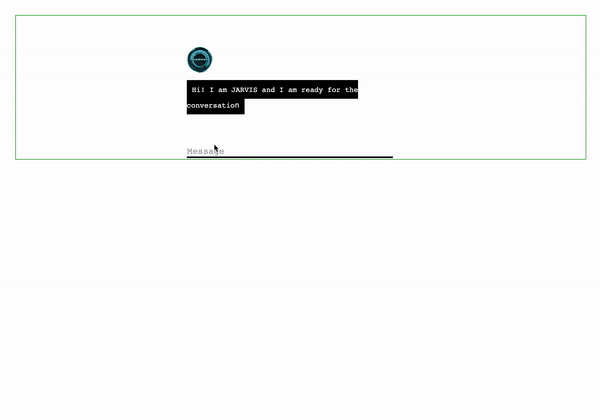

#### Chatbot
This is a pet-project to showcase development of a chatbot using Python, Flask and Natural Language Processing algorithms.

DialoGPT is used for multiturn general dialogue and Universal Sentence Encoder for goal oriented dialogue based on custom question-answer pairs.

#### Demo

#### How it works:
1) First, we compare user text with predefined questions using [Universal Sentence Encoder](https://tfhub.dev/google/universal-sentence-encoder/4) to encode texts into vectors and compare vectors via cosine similarity. If cosine similarity is greater than some threshold(see [config.py](config.py)) we reply with predefined appropriate answer. Custom question-answer pairs are in [data/custom_question_answer_pairs.csv](data/custom_question_answer_pairs.csv) file and can be extended with more pairs.
2) If the cosine similarity is below the threshold, we process the user question with [DialoGPT](https://huggingface.co/microsoft/DialoGPT-medium) - which generates answer token by token and can handle multiturn dialogue, meaning it takes the history of dialigue as input for the model.
3) DialoGPT model has three versions with sizes `small`, `medium` and `large`. These can be set in [config.py](config.py).
4) Keywords `restart` and `forget` - clean up the history to start the dialogue from scratch. These keywords are set in [data/restart_keywords.csv](data/restart_keywords.csv) file and can be extended with more keywords.
5) Keywords `exit` and `bye` - also clean up the history and can be potentially used to shut down the app. These keywords are set in [data/exit_keywords.csv](data/exit_keywords.csv) file and can be extended with more keywords. 

#### How to run:
- If running for the first time:
    1) `$ sh build_docker_image.sh` - build docker image with python3.8 and installed requirements(needs to be built only once, builts image with name `chatbot_docker_image`).
    2) `$ sh run_web_app.sh` - run container with previously built docker image and run web application(runs container with name `chatbot`).
- If changed some code (e.g. configs) and need to re-run:
    1) `$ docker restart chatbot` - just restart the container, all source files are mounted as volumes.

#### Resources:
 - Pretrained DialoGPT: [hugginface](https://huggingface.co/microsoft/DialoGPT-medium)
 - Pretrained Universal Sentence Encoder: [tfhub.dev](https://tfhub.dev/google/universal-sentence-encoder/4)
 - HTML template is based on [this example](https://github.com/sahil-rajput/Candice-YourPersonalChatBot/blob/master/templates/home.html) and has beend modified.
